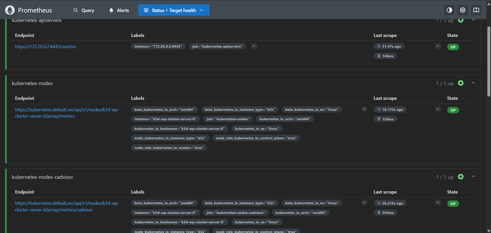
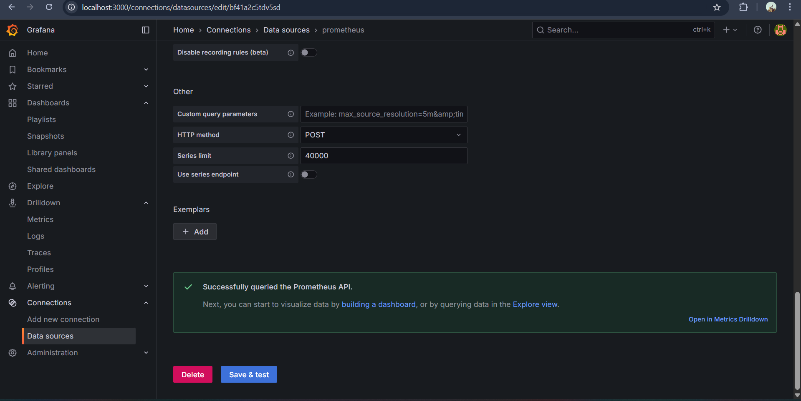
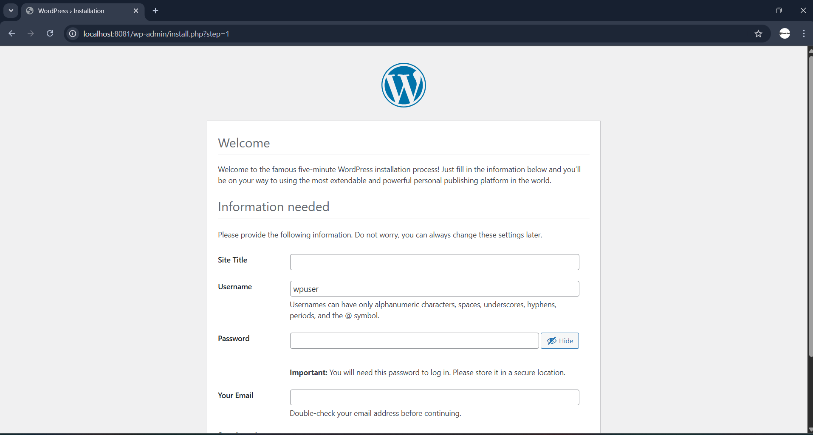
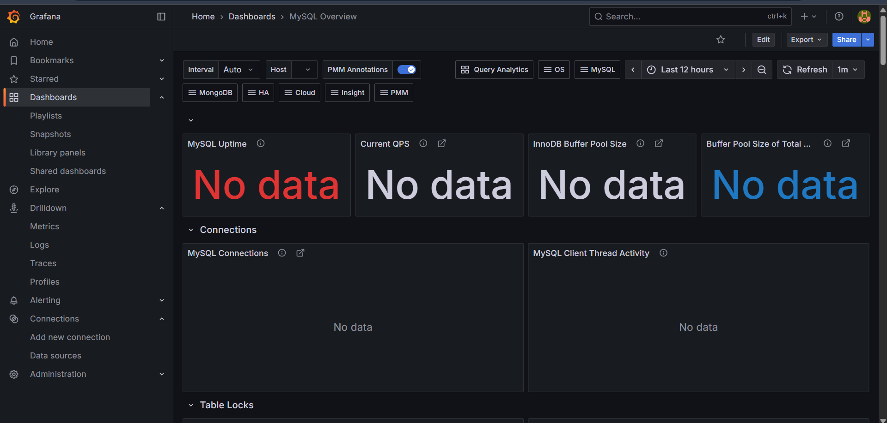

# WordPress on Kubernetes (k3d) – Production-Grade Assignment

## Project Overview
This project demonstrates a production-grade deployment of WordPress on Kubernetes using k3d (Kubernetes in Docker) for local development. It features:
- Persistent storage for WordPress and MySQL
- Custom Nginx (OpenResty + Lua) proxy
- Helm charts for all services
- Prometheus and Grafana monitoring


## Why k3d over k3s and Minikube?
- **Lightweight & Fast:** k3d runs k3s clusters inside Docker containers, making it faster and more resource-efficient than Minikube or native k3s.
- **Easy Cleanup & Management:** k3d clusters can be created and deleted quickly, perfect for local dev and CI.
- **Better Windows Support:** Minikube runs kubelet and master on the same machine, which can cause issues on Windows. k3d leverages Docker Desktop for seamless networking and isolation.

## Prerequisites
**Windows 10/11**
**Docker Desktop** (installed)
**Chocolatey** (Windows package manager)
    - If Chocolatey is not installed, follow the official instructions at https://chocolatey.org/install 
**k3d**: Install via `choco install k3d`
**Helm**: Install via `choco install kubernetes-helm`
**Kubectl**: Install via `choco install kubernetes-cli -y`

## Persistent Storage: PV & PVC
We created separate PersistentVolumes (PV) and PersistentVolumeClaims (PVC) for both WordPress and MySQL right now in RWO access mode :
- **WordPress:** `wp-local-pv` and `wp-local-pvc`
- **MySQL:** `mysql-local-pv` and `mysql-local-pvc`

**Apply them with:**
```sh
kubectl apply -f wordpress-pv.yaml
kubectl apply -f wordpress-pvc.yaml
kubectl apply -f mysql-pv.yaml
kubectl apply -f mysql-pvc.yaml
```

### Why RWO (local-path) and not RWX (NFS/Cloud)?


**RWO/local-path:** Works reliably for local dev in k3d/Windows. Each pod gets its own storage, but only one pod can write to the volume at a time (ReadWriteOnce).

**RWX (ReadWriteMany) scenarios:**
- RWX allows multiple pods to read/write the same volume, which is required for scaling WordPress or other apps horizontally.
- RWX is not supported natively in k3d/Windows because local-path provisioner only supports RWO.
- For RWX in production:
    - **NFS:** Deploy an NFS server in your cluster (Linux/cloud only), create RWX PVs/PVCs, and update your manifests to use the NFS storage class. This allows multiple pods to share the same storage and scale horizontally.
    **Example NFS RWX PV/PVC:**
        _persistent-nfs-pv.yaml_
        ```yaml
        apiVersion: v1
        kind: PersistentVolume
        metadata:
            name: nfs-pv
        spec:
            capacity:
                storage: 10Gi
            accessModes:
                - ReadWriteMany
            nfs:
                path: /srv/nfs/kubedata
                server: <NFS_SERVER_IP>
        ```

        _persistent-nfs-pvc.yaml_
        ```yaml
        apiVersion: v1
        kind: PersistentVolumeClaim
        metadata:
            name: nfs-pvc
        spec:
            accessModes:
                - ReadWriteMany
            resources:
                requests:
                    storage: 10Gi
            volumeName: nfs-pv
        ```
    - **AWS EFS:** Use the EFS CSI driver in EKS to create RWX volumes. Update your PVs/PVCs to use the `efs` storage class. This is the recommended approach for cloud-native, scalable deployments.

**Why not RWX for local dev?**
- k3d/Windows does not support RWX out of the box.
- NFS server pods may not work reliably on Windows/k3d due to networking and filesystem limitations.
- For local testing, RWO/local-path is the best practice. For production, switch to RWX (NFS/EFS) as described above.

## MySQL Deployment
- Helm chart: `charts/mysql`
- Uses its own PV/PVC and Kubernetes Secret for credentials.
- Deploy with:
```sh
helm install mysql charts/mysql
```

## WordPress Deployment
- Helm chart: `charts/wordpress`
- Uses its own PV/PVC and connects to MySQL via Secret.
- Deploy with:
```sh
helm install wordpress charts/wordpress
```

## Nginx (OpenResty + Lua) Proxy
 Custom Dockerfile and `nginx.conf` for proxying to WordPress.
 Nginx is exposed for external access using NodePort (see `kubectl get svc nginx` for port and IP), or you can use port-forward for local access.
 Deploy with:
 ```sh
 helm install nginx charts/nginx
 ```
 Access via port-forward:
 ```sh
 kubectl port-forward svc/nginx 8080:80
 ```
 Open [http://localhost:8080](http://localhost:8080) in your browser.

 Alternatively, use NodePort and your cluster node's IP for direct access:
 ```sh
 kubectl get svc nginx
 ```
 Then open `http://<NodeIP>:<NodePort>` in your browser.

## Monitoring Stack: Prometheus & Grafana
- Installed via Helm charts.
- ServiceMonitor configured for scraping metrics.
- Deploy with:
```sh
helm repo add prometheus-community https://prometheus-community.github.io/helm-charts
helm repo add grafana https://grafana.github.io/helm-charts
helm upgrade --install prometheus prometheus-community/kube-prometheus-stack
helm upgrade --install grafana grafana/grafana
```
- Access Prometheus:
```sh
kubectl port-forward svc/prometheus-kube-prometheus-prometheus 9090:9090
```
Open [http://localhost:9090](http://localhost:9090)
- Access Grafana:
```sh
kubectl port-forward svc/grafana 3000:80
```
Open [http://localhost:3000](http://localhost:3000)

Alternatively, you can expose Prometheus and Grafana via NodePort for direct browser access. Edit the respective service YAMLs to set `type: NodePort` and check the assigned port with:
```sh
kubectl get svc prometheus-kube-prometheus-prometheus
kubectl get svc grafana
```
Then access them at `http://<NodeIP>:<NodePort>`.

**Metrics & Assignment Requirements:**
- Prometheus scrapes metrics from all major components (WordPress, MySQL, Nginx).
- Grafana dashboards should visualize:
    - Pod CPU utilization
    - Nginx total request count
    - Nginx 5xx error count
    - WordPress and MySQL health metrics
- ServiceMonitor is configured for automatic metric discovery.

## Best Practices & Limitations
- **RWO/local-path** for local dev; **RWX/NFS/EFS** for production.
- Separate PV/PVC for each service.
- Use Kubernetes Secrets for sensitive data.
- NodePort only for Nginx; ClusterIP for internal services.

## Troubleshooting
- If you see 404 or missing assets, check Nginx proxy headers and config.
- For RWX, use NFS/EFS in a Linux or cloud environment.
- For stuck PV/PVC, delete and re-apply with `kubectl delete` and `kubectl apply`.

## Images
Prometheus & Grafana dashboards:

### Prometheus Dashboard


### Grafana Dashboard


### WordPress Home Page



> Note: My Prometheus data sources and metrics status were up, but there was an issue with data not showing up in Grafana. I tried to fix it but was unable to resolve the problem during this assignment.
## Problem:


## Final Notes

This setup is ready for local development and can be adapted for production with RWX storage and cloud-native solutions.